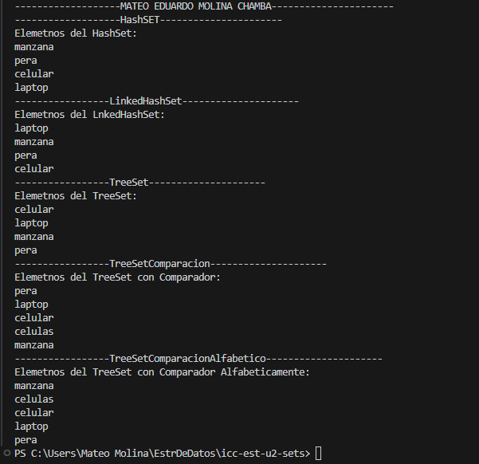

# Colecciones - SETS - Práctica de Estructuras Avanzadas

## 📌 Información General

- **Título:** Implementación de HashSets
- **Asignatura:** Estructura de Datos
- **Carrera:** Computación
- **Estudiante:** Mateo Molina
- **Fecha:** 1/07/2025
- **Profesor:** Ing. Pablo Torres

---

## 🛠️ Descripción

Este proyecto implementa LOS DISTINTOS METODOS SETS.

- Usar todos los metodos Sets

La lógica principal se encuentra en [`src.controllers.Sets.java`] y se ejecuta en ['src/app.java']

---

## 🚀 Ejecución

Para compilar y ejecutar el proyecto desde la terminal:

```sh
javac -d bin src/App.java src/controllers/Sets.java 
java -cp bin App
```

---

## 🧑‍💻 Ejemplo de Salida





```plaintext
-------------------MATEO EDUARDO MOLINA CHAMBA----------------------
-------------------HashSET----------------------
Elemetnos del HashSet: 
manzana
pera
celular
laptop
-----------------LinkedHashSet---------------------
Elemetnos del LnkedHashSet: 
laptop
manzana
pera
celular
-----------------TreeSet---------------------
Elemetnos del TreeSet: 
celular
laptop
manzana
pera
-----------------TreeSetComparacion---------------------
Elemetnos del TreeSet con Comparador: 
pera
laptop
celular
celulas
manzana
-----------------TreeSetComparacionAlfabetico---------------------
Elemetnos del TreeSet con Comparador Alfabeticamente: 
manzana
celulas
celular
laptop
pera
PS C:\Users\Mateo Molina\EstrDeDatos\icc-est-u2-sets> 
```

---

## 📂 Estructura del Proyecto

```
src/
  App.java
    controllers/
      Sets.java
    
```

---

## 📄 Notas

- El proyecto está configurado para usar la carpeta `src` como fuente y `bin` como salida de compilación.
- No requiere librerías externas.

---